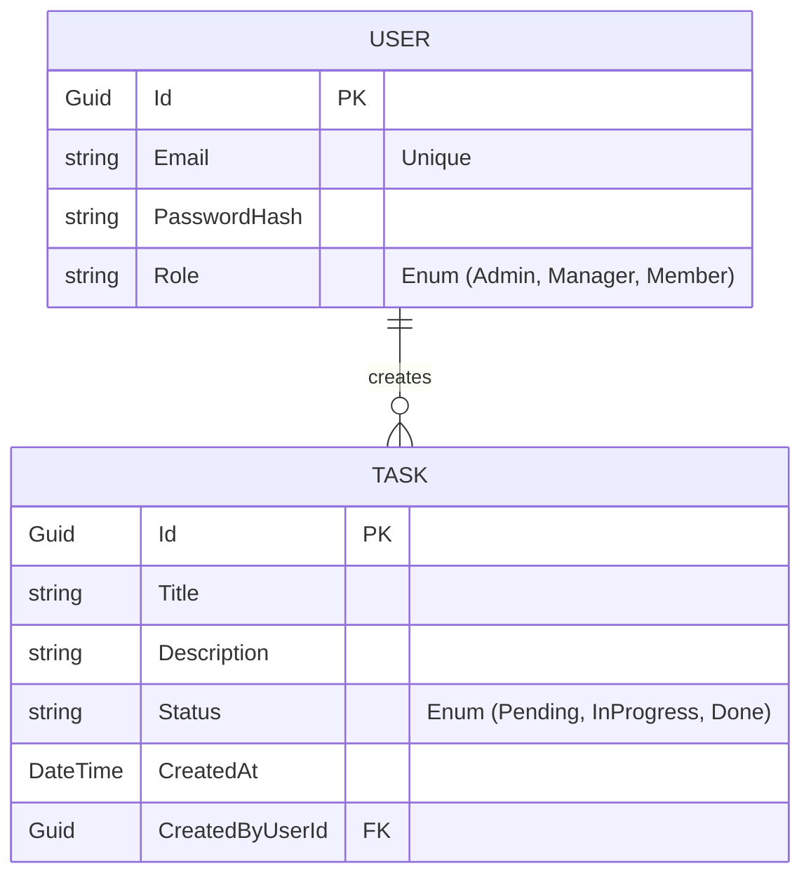

# Documentação de Relacionamento de Dados (DR)

Este documento descreve a estrutura de dados do sistema Workplace Tasks utilizando o banco de dados PostgreSQL.

## 📊 Diagrama de Entidade-Relacionamento (ER)

## 📝 Descrição das Tabelas

### Tabela: `Users`
Armazena as informações dos colaboradores e administradores do sistema.
- **Id**: Identificador único (UUID).
- **Email**: Endereço de e-mail (utilizado para login, deve ser único).
- **Role**: Nível de acesso que define as permissões de RBAC.
- **PasswordHash**: Senha criptografada.

### Tabela: `Tasks`
Armazena as tarefas cadastradas no fluxo de trabalho.
- **Id**: Identificador único (UUID).
- **Title**: Título curto da tarefa.
- **Description**: Detalhamento opcional.
- **Status**: Estado atual da tarefa.
- **CreatedByUserId**: Chave estrangeira ligando a tarefa ao usuário que a criou.

## 🔒 Regras de Integridade
1. **Unicidade**: O e-mail do usuário é único em toda a base.
2. **Relacionamento**: Uma tarefa sempre pertence a um usuário (`CreatedByUserId`).
3. **RBAC**: As permissões de acesso (Read/Update/Delete) são validadas no nível de aplicação (Policies) consultando a coluna `Role` e o ownership (`CreatedByUserId`).
